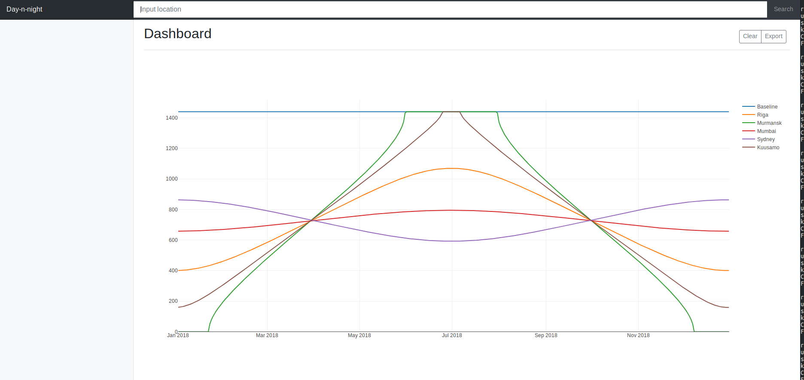

# Day and Night

## What is this?

It's a small utility to plot day length (in minutes) through one year based
on location:



## How to use

```bash
git clone https://github.com/kykc/day-and-night.git
cd day-and-night
npm install
npm run web
```

Then you can open browser at `http://localhost:3088` and start plotting

## Precision

There's two points that should be kept in mind while using this utility:

1. We assume that "day length" is time from astronomical dawn till astronomical dusk.
  In other words, the time which sun is above horizon.
2. Plotted data is calculated analytically and my tests showed that it
  slightly differs from empiric measures that could be obtained [here](https://api.sunrise-sunset.org/json?lat=47.431&lng=3.496&date=2017-06-22&formatted=0)
  
